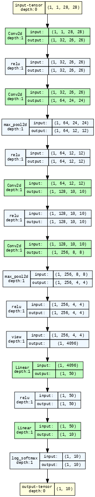

# Session 5 Assignment

This is a modular implementation for S5 - Assignment QnA.

This contains 4 files 
1. model.py
2. utils.py
3. S5.ipynb
4. README.md

## model.py

In this file , model network is defined. 

 

